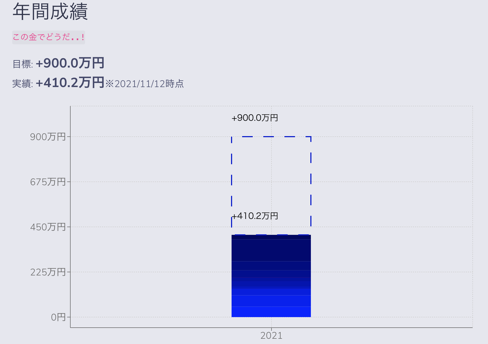
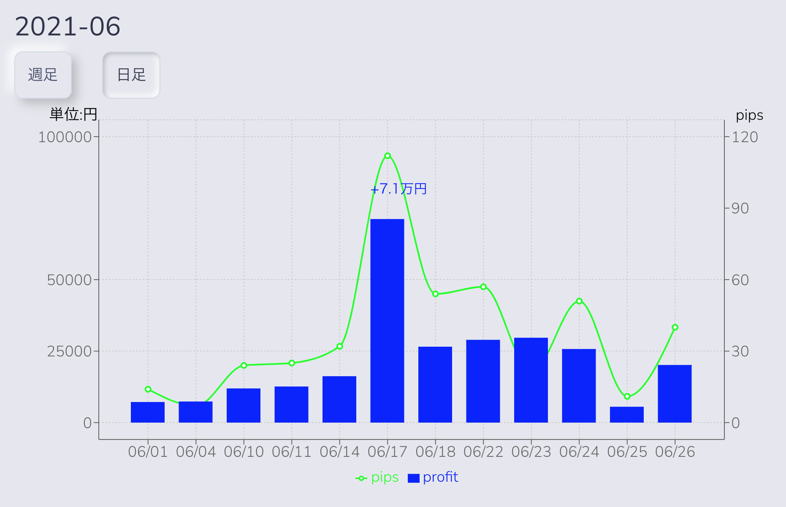
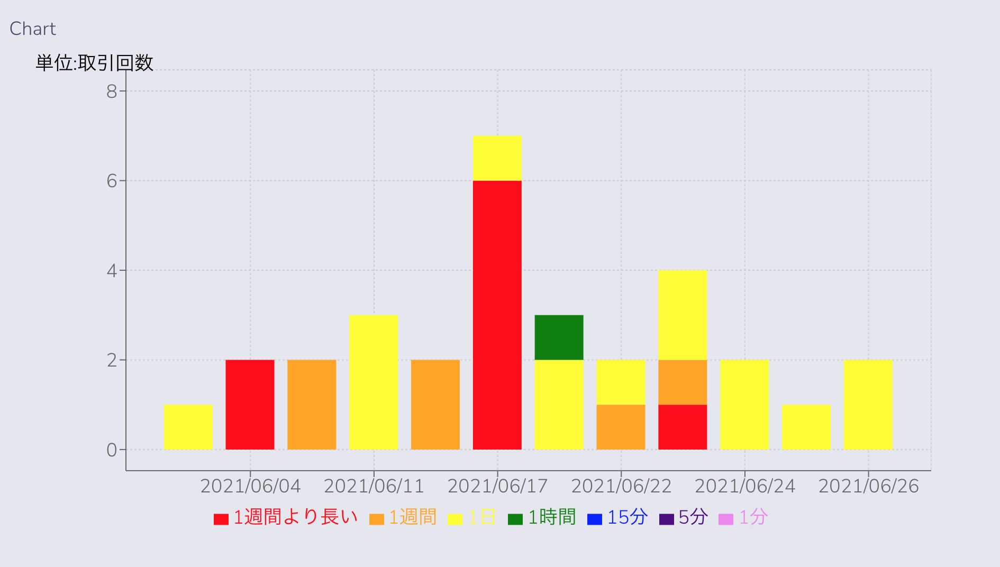
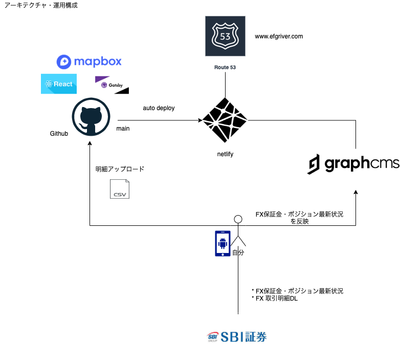
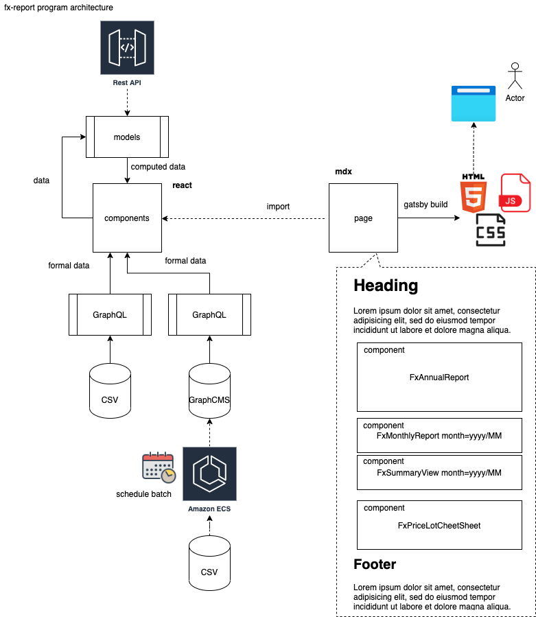

# fx-reports

## 概要

* FX取引の月次レポート DIYアプリ `じゃりんじゃりん稼ぐぜ` のリポジトリへようこそ

* お金という人間らしいテーマで開発しました。生きてるってすばらしいですね。

* このように月次の取引成績とコメントがグラフで出ます。

## システム構成

* 

* 

## 技術スタック

* Frontend
  * NodeJs>=15
  * Gatsby, React Bootstrap, Rechart, Mapbox

* Backend
  * Netlify : https://app.netlify.com/sites/goofy-bohr-20d740/overview
  * GraphCMS : https://app.graphcms.com/a83c9f9e7dae4541a8c6e1ac08a9495f/master/settings/project
  * AWS : https://console.aws.amazon.com/route53/v2/hostedzones#ListRecordSets/Z08256261BDETXBUSKFLN
  * Github Workflow(CI) : https://github.com/Eigo-Mt-Fuji/fx-report/tree/master/.github/workflows

* Tool
  * Python
      * [validate-fx-buysell-order](./scripts/validate-fx-buysell-order.py)
        * SBIから取得したCSV内に、実施した覚えのない決済売が2回連続するという不整合があったので検知する処理をスクリプト化
        * push時にgithub上で以下のように実行・エラーを検知
  * Analytics
     * Gtag https://analytics.google.com/analytics/web/?authuser=0#/a221044200p304415269/admin/streams/table/
     * Optimize Container https://optimize.google.com/optimize/home/#/accounts/4704735488/containers/15058710

## 備考

- [資産形成能力開発の手引き〜そうだ能力を開発しよう〜](https://github.com/Eigo-Mt-Fuji/portfolio-2021/blob/main/docs/README-%E6%8A%95%E8%B3%87%E8%83%BD%E5%8A%9B%E9%96%8B%E7%99%BA.md)

- [FX取引ルール〜取引の心得と予算別目標ロット数〜](https://github.com/Eigo-Mt-Fuji/efg-confidential/blob/master/final_income_tax/README-FX-TRADING-RULE.md)

- [2021年1月のFX取引分析](https://github.com/Eigo-Mt-Fuji/portfolio-2021/blob/main/docs/README-%E5%80%8B%E4%BA%BA%E5%AD%A6%E7%BF%92-20210115.md#123-fx%E5%8F%96%E5%BC%95%E5%88%86%E6%9E%90-2021%E5%B9%B41%E6%9C%88)

- [経営202X　年商XX万円／資産**万円の俺を生きる](https://docs.google.com/spreadsheets/d/1_QsP0MwbVFjJtVrVvUR9tcbFUOPZIyfzReX0vniWu6E/edit#gid=84168650)
