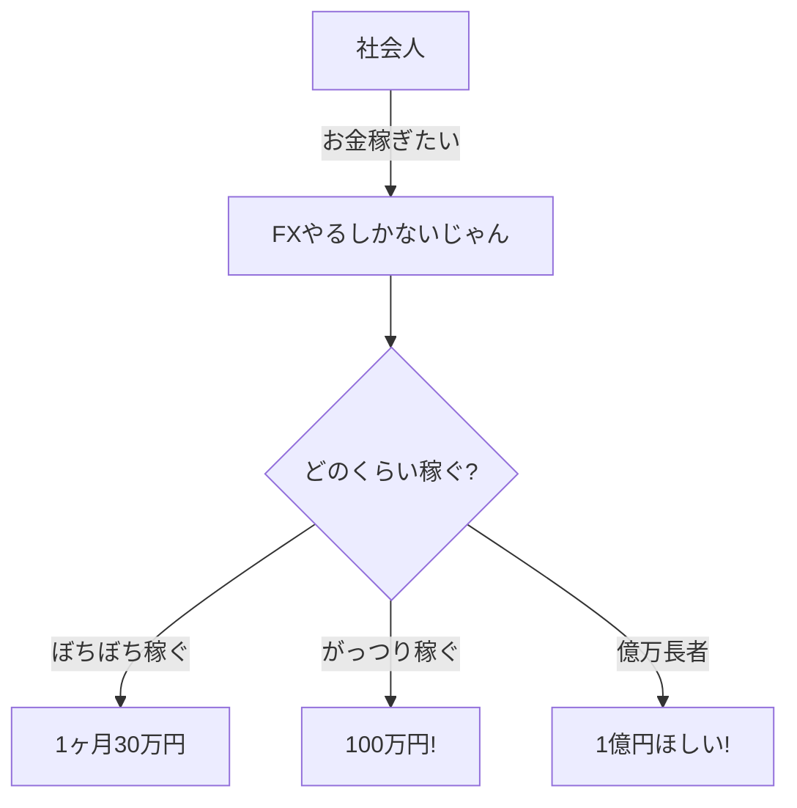
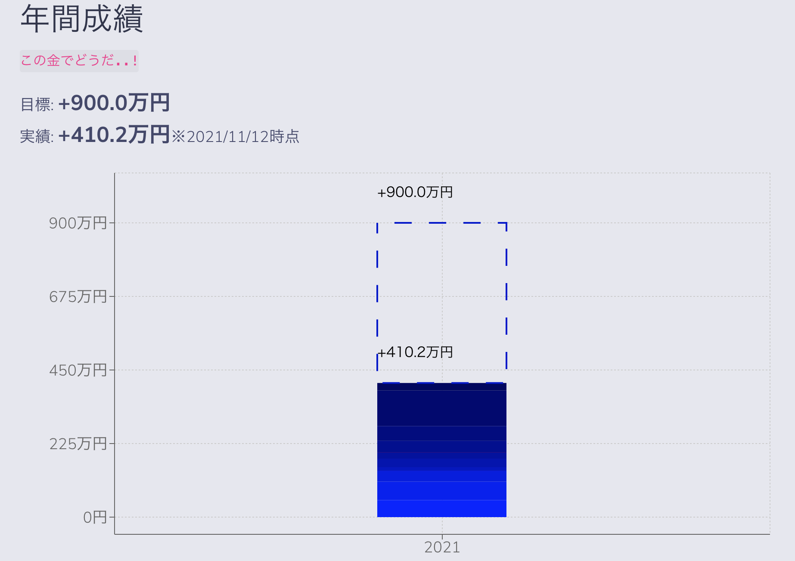
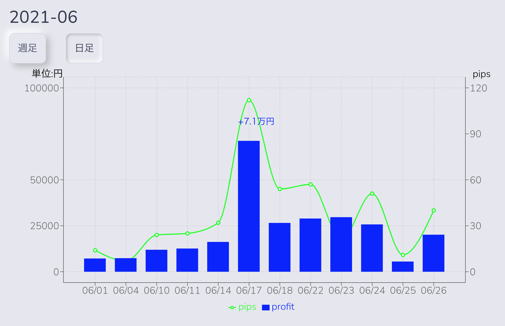
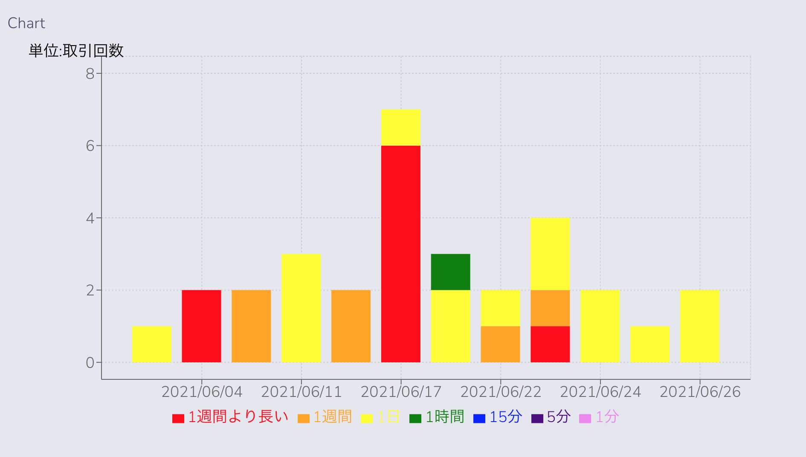

# fx-reports 

FX取引の月次レポート DIYアプリ 
`じゃりんじゃりん稼ぐぜ` 

## 概要

- ~~FX取引の月次レポート。Webエンジニア と 自営業(社会人)の現実課題が合わさったビターな制作物~~ 一種のジョークアプリですm(_ _)m
  - お金という人間らしいテーマで開発 -> 生きてるってすばらしいですね(謎)
  - typescript, reactでアプリ開発(自由に開発)したいという気持ちで作成
  - rechartというライブラリを使って、グラフ表示してます
    - 年間の実績を積み上げ棒グラフで表示したり、週単位(日単位)の実績(金額/pips)をグラフに表示しています
  - テストコードなどはありません。遠いめでご覧ください
- 工夫のポイントは、座標軸や凡例をカスタマイズしているのがポイントです。
  - 例えば、週の実績をグラフに出すとき、実績の金額に応じて、座標軸のメモリが変化するように実装しています
    - 座標軸の金額表記を１０万 -> １００万と指数的に増える
      - 実績金額が増えたとき、慢心せず次の目標を意識して取引を継続できるように(ドM)

- このように月次の取引成績とコメントがグラフで出ます。

## システム構成・設計

- wikiを参照
  - https://github.com/Eigo-Mt-Fuji/fx-report/wiki

## 備考

- [資産形成能力開発の手引き〜そうだ能力を開発しよう〜](https://github.com/Eigo-Mt-Fuji/efg-confidential/issues/20)

- [FX取引ルール〜取引の心得と予算別目標ロット数〜](https://github.com/Eigo-Mt-Fuji/efg-confidential/blob/master/final_income_tax/README-FX-TRADING-RULE.md)

- [2021年1月のFX取引分析](https://github.com/Eigo-Mt-Fuji/portfolio-2021/blob/main/docs/README-%E5%80%8B%E4%BA%BA%E5%AD%A6%E7%BF%92-20210115.md#123-fx%E5%8F%96%E5%BC%95%E5%88%86%E6%9E%90-2021%E5%B9%B41%E6%9C%88)

- [経営202X　年商XX万円／資産**万円の俺を生きる](https://docs.google.com/spreadsheets/d/1_QsP0MwbVFjJtVrVvUR9tcbFUOPZIyfzReX0vniWu6E/edit#gid=84168650)
